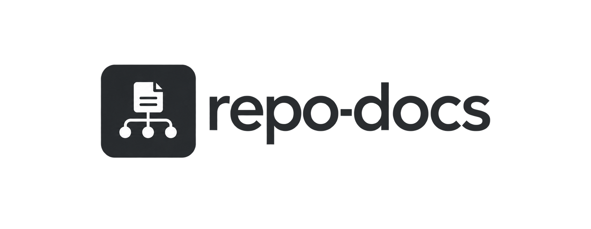

<p align="center">
  
</p>

# repo-docs

repo-docs is a portable agent skill that keeps a repository's instruction
files correct and progressively disclosed. It ships as a Claude Code or
Codex plugin with a session hook, and as a plain skill for other agents.

The core principle, unchanged wherever it is quoted:

> Put information at the narrowest scope where it stays authoritative, and
> load it only when the task needs it.

## The problem

Instruction files start small and useful. Left alone, they grow. A root
`AGENTS.md` picks up rules that only apply to one package, notes that
duplicate what the code already shows, and paragraphs nobody has reread in
months. All of it loads into every session, on every task, whether the task
needs it or not. Meanwhile rules that should be visible everywhere end up
buried in a subdirectory nobody bridges, or the reverse: a rule that only
applies to one subtree sits in the root file and loads for work that never
touches that subtree. repo-docs exists to catch both failure modes, not to
promise a tidier repo.

## The structure contract

| Path | Owns | When it loads |
|---|---|---|
| `AGENTS.md` (root) | repo-wide commands, hard constraints, pointers | always |
| `CLAUDE.md` (root) | nothing of its own; `@AGENTS.md` first line | always |
| `<dir>/AGENTS.md` | rules that apply only under `<dir>` | with its bridge |
| `<dir>/CLAUDE.md` | nothing of its own; `@AGENTS.md` first line | when Claude reads a file in `<dir>` |
| `docs/**.md` | long-form architecture, workflows, runbooks | when linked and needed |
| `README.md` | humans: what it is, install, usage | not auto-loaded; read when relevant |

`AGENTS.md` is canonical. `CLAUDE.md` is a bridge, never a second source of
truth. A `CLAUDE.md` may add Claude-only lines after the import, but it must
not restate what `AGENTS.md` already says.

## Why the CLAUDE.md bridge exists

Claude Code does not load `AGENTS.md` as instructions, and no setting
changes this. Its `/init` can read one to generate a `CLAUDE.md`, but that
is a one-time copy, not a live link.
It does discover `CLAUDE.md` in subdirectories of the working directory, and
it loads each one lazily, only when it reads a file in that subdirectory. A
`CLAUDE.md` whose entire content is the single line `@AGENTS.md` expands
that import at load time, so it pulls in the sibling `AGENTS.md`. On Unix,
`ln -s AGENTS.md CLAUDE.md` does the same thing.

The consequence: a nested `AGENTS.md` with no sibling `CLAUDE.md` bridge is
invisible to Claude Code. Moving a rule out of the root file without adding
that bridge deletes the rule from every Claude session that touches that
subtree. This is also the progressive disclosure mechanism: the root bridge
loads on every session, and nested bridges load only when Claude actually
works in that part of the tree.

Source: https://code.claude.com/docs/en/memory, last checked 2026-09-17.
The `bridge` error rests on this fact. If Claude Code ever starts reading
`AGENTS.md` on its own, re-check that page and retire the `bridge` check
rather than leaving it to fire on every session.

### Why bridges rather than `.claude/rules/`

Claude Code also loads `.claude/rules/*.md`, and a rule file with `paths:`
frontmatter loads only when Claude reads a matching file. That is a real
scoped-loading mechanism, but it is Claude-only: Codex and other agents
never see it. repo-docs uses `AGENTS.md` plus a bridge because the rule
then lives in one file every agent reads, at the scope it governs. If a
repo keeps its rules in `.claude/rules/` and a standalone root `CLAUDE.md`
over 300 bytes with no `AGENTS.md`, the checker reports the root file as a
`rival`.
That is accurate: those rules are invisible to every other agent. The
checker does not read `.claude/rules/` and does not report on it.

## Install

### Claude Code

This repository acts as its own plugin marketplace: it carries a
`.claude-plugin/marketplace.json` alongside `plugin.json`, so the install is
persistent instead of something you have to remember to re-invoke every
session. Inside a Claude Code session, run:

```
/plugin marketplace add vibecodedapps-official/repo-docs
/plugin install repo-docs@repo-docs
```

To install from a clone instead, point the first command at the directory:

```
/plugin marketplace add /path/to/repo-docs
/plugin install repo-docs@repo-docs
```

The `SessionStart` hook is then live in every future session, in any
project, with no flag and no `settings.json` editing. This is the
recommended path.

For one-off testing without installing anything, start Claude Code with the
`--plugin-dir` flag instead:

```
claude --plugin-dir /path/to/repo-docs
```

This loads the plugin, hook included, only for that one session; you would
need to pass the flag again every time you start Claude Code. It is meant
for trying repo-docs out or developing against a local checkout, not for
everyday use.

### Codex

Codex supports native `SessionStart` hooks. See [docs/codex.md](docs/codex.md)
for the skill install, the hook definition, and plugin distribution.

### Windows

The bundled plugin command, for Claude Code and for Codex, uses POSIX shell
syntax, and the repair commands in findings are written for a POSIX shell. On
Windows, Claude Code runs the hook in Git Bash, which handles that syntax; run
the repair commands in Git Bash too. The hook fails there when `python3`
resolves to the Microsoft Store stub, which a python.org install leaves in
place. Turn off the `python3` entry under Settings > Apps > Advanced app
settings > App execution aliases, or put a `python3` shim on `PATH`. No
Windows-specific command is supplied.

### Other agents or skill-only installs

```
npx skills add ./skills/repo-docs
```

This installs the skill without registering a hook. For agents without
session hooks, run the checker from the repo's own checks or from CI
instead. See the GitHub Actions snippet below.

## Usage

repo-docs runs in one of two modes:

- **audit**: read only. Runs the checker, adds judgement findings on top of
  it, and reports. Changes nothing.
- **maintain**: applies documentation changes, including first-time setup
  for a repo that has no instruction files yet. Missing files are an input
  condition for maintain mode, not a separate mode of their own.

## The checker

```
repo_docs_check.py [ROOT] [--json] [--hook] [--stale-threshold N]
```

- `ROOT` defaults to the current working directory.
- `--json` prints one JSON object to stdout and nothing else.
- `--hook` prints a Claude Code / Codex `SessionStart` hook payload and always
  exits 0.
- `--stale-threshold N` overrides the staleness threshold. Default is 20.

Exit codes:

- `0`: no `error` findings. This can still mean there are `warning` or
  `info` findings; only `error` findings affect the exit code.
- `1`: at least one `error` finding.
- `2`: usage error, or the checker itself failed.

## The five checks

1. `bridge` (error): every directory with an `AGENTS.md` must have a
   `CLAUDE.md` that symlinks to it or whose first non-blank line is exactly
   `@AGENTS.md`.
2. `rival` (warning): a `CLAUDE.md` over 300 bytes with no sibling
   `AGENTS.md` is acting as an independent instruction file.
3. `size` (info above 2000 bytes, warning above 6000 bytes): byte size of
   each `AGENTS.md`, measured as UTF-8 bytes on disk.
4. `link` (error): a markdown inline link inside `AGENTS.md`, `CLAUDE.md`,
   or any `.md` under the root `docs/` whose local-file target does not
   exist on disk. Links inside fenced code blocks are ignored.
5. `stale` (info): the instruction files have not changed in longer than
   the staleness threshold, measured in commits touching other files.

## What repo-docs deliberately does not check

These checks were cut from the MVP, all for the same reason: they produce
false positives. A checker that cries wolf gets switched off, which defeats
the point of running one at all.

- Commands cited in `AGENTS.md` against `package.json`, `Makefile`, or
  `justfile` scripts.
- Duplicated lines between a parent and a nested `AGENTS.md`.
- Orphaned files under `docs/` that nothing links to.
- Paths written in backticked inline code.
- Environment variable names.
- Numeric limits other than the byte budgets above.
- External links.
- Frontmatter dates.
- Reference-style links (`[text][label]` with a `[label]: path` line).
  Only inline `[text](path)` links are checked.
- Code spans that run across a line break. A backticked span is skipped
  only when it opens and closes on the same line.
- `@imports` past the first hop. The `bridge` check confirms `CLAUDE.md`
  imports `AGENTS.md`; what `AGENTS.md` itself imports is not followed.
- Merge commits in the `stale` count. Only non-merge commits that touch
  files outside the instruction set are counted.
- Staleness when git does not answer within 10 seconds. Each git call is
  bounded so a slow or hung filesystem cannot stall the session hook; on
  expiry the `stale` check is skipped, as it is in a shallow clone.

These are judgement calls, not mechanical ones. repo-docs leaves them to the
skill's audit and maintain modes, where a person or an agent can read the
surrounding context before flagging something.

One more limit worth knowing: the checker does not follow directory
symlinks, so instruction files inside a symlinked directory go unscanned.
This avoids infinite traversal through a symlink cycle and avoids reporting
findings about files outside the repository. Run the checker against the
real location of a linked directory as its own `ROOT` to cover it.

## A note on the byte budgets

The size thresholds are editorial defaults, not measured optima. Nobody ran
an experiment to find the exact byte count where an `AGENTS.md` stops
paying for itself. If a real constraint pushes a file over a budget, keep
the constraint. Never delete a necessary rule just to make a size finding
go away.

## GitHub Actions

This snippet is for repos that want the mechanical checks enforced on pull
requests without installing the plugin.

```yaml
name: repo-docs
on: pull_request
jobs:
  check:
    runs-on: ubuntu-latest
    steps:
      - uses: actions/checkout@v4
        with:
          fetch-depth: 0
      - run: |
          curl -fsSL -o repo_docs_check.py \
            https://raw.githubusercontent.com/vibecodedapps-official/repo-docs/v0.1.1/skills/repo-docs/scripts/repo_docs_check.py
          python3 repo_docs_check.py .
```

The URL pins a release tag; bump it when you move to a newer release. The
checker is one file with no dependencies beyond the standard library, so you
can also copy `skills/repo-docs/scripts/repo_docs_check.py` into your own
repository and run it directly. Vendoring it removes the network call, which
matters if your runners have no outbound access.

The `fetch-depth: 0` setting is there because the staleness check reads
commit history, and the default shallow clone has none to read.
